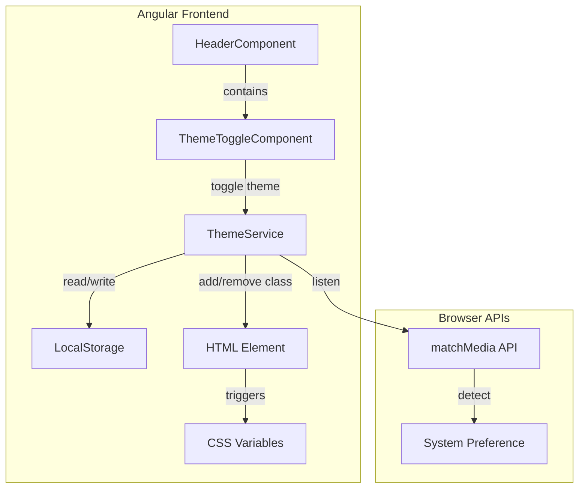

# Design Document: Dark/Light Mode

## Overview

Tính năng Dark/Light Mode cho SpringFood sẽ được triển khai hoàn toàn ở frontend với các thành phần chính:

1. **ThemeService** - Angular service quản lý trạng thái theme
2. **Theme CSS Variables** - Hệ thống CSS variables cho cả light và dark mode
3. **ThemeToggleComponent** - Component toggle button trong Header
4. **Theme Initialization Script** - Script chạy trước Angular để tránh flash

## Architecture



## Components and Interfaces

### 1. ThemeService

```typescript
// src/app/services/theme.service.ts

export type ThemeMode = 'light' | 'dark';

export interface ThemeService {
  /** Current theme mode */
  currentTheme: Signal<ThemeMode>;
  
  /** Toggle between light and dark */
  toggleTheme(): void;
  
  /** Set specific theme */
  setTheme(theme: ThemeMode): void;
  
  /** Get system preference */
  getSystemPreference(): ThemeMode;
  
  /** Initialize theme on app start */
  initializeTheme(): void;
}

// Constants
export const THEME_STORAGE_KEY = 'springfood-theme';
export const DARK_CLASS = 'dark';
```

### 2. ThemeToggleComponent

```typescript
// src/app/components/theme-toggle/theme-toggle.component.ts

export interface ThemeToggleComponent {
  /** Current theme from service */
  currentTheme: Signal<ThemeMode>;
  
  /** Handle toggle click */
  onToggle(): void;
  
  /** Animation state for icon transition */
  isAnimating: boolean;
}
```

### 3. CSS Variables Structure

```typescript
// Theme variable categories
interface ThemeVariables {
  // Background colors
  '--bg-page': string;
  '--bg-card': string;
  '--bg-subtle': string;
  '--bg-hover': string;
  '--bg-active': string;
  
  // Text colors
  '--text-primary': string;
  '--text-secondary': string;
  '--text-muted': string;
  '--text-disabled': string;
  
  // Border colors
  '--border-default': string;
  '--border-subtle': string;
  '--border-strong': string;
  
  // Shadow colors (for dark mode adjustment)
  '--shadow-color': string;
}
```

## Data Models

### LocalStorage Schema

```typescript
// Key: 'springfood-theme'
// Value: 'light' | 'dark'
// Example: "dark"
```

### HTML Class Application

```html
<!-- Light mode (default) -->
<html>

<!-- Dark mode -->
<html class="dark">
```

## Color Palette

### Light Mode Colors (Current - Giữ nguyên)

| Variable | Value | Usage |
|----------|-------|-------|
| `--bg-page` | `#ffffff` | Main page background |
| `--bg-card` | `#ffffff` | Card backgrounds |
| `--bg-subtle` | `#f9fafb` | Subtle section backgrounds |
| `--bg-hover` | `#f3f4f6` | Hover states |
| `--text-primary` | `#111827` | Main text |
| `--text-secondary` | `#4b5563` | Secondary text |
| `--text-muted` | `#6b7280` | Muted text |
| `--border-default` | `#e5e7eb` | Default borders |
| `--color-primary` | `#ff6b35` | Brand orange (unchanged) |

### Dark Mode Colors (Mới - Phù hợp với SpringFood)

| Variable | Value | Usage |
|----------|-------|-------|
| `--bg-page` | `#0f0f0f` | Main page background (near black) |
| `--bg-card` | `#1a1a1a` | Card backgrounds |
| `--bg-subtle` | `#242424` | Subtle section backgrounds |
| `--bg-hover` | `#2d2d2d` | Hover states |
| `--text-primary` | `#f9fafb` | Main text (off-white) |
| `--text-secondary` | `#a1a1aa` | Secondary text |
| `--text-muted` | `#71717a` | Muted text |
| `--border-default` | `#27272a` | Default borders |
| `--color-primary` | `#ff7f50` | Brand orange (slightly lighter for dark bg) |

### Semantic Color Adjustments for Dark Mode

| Category | Light | Dark | Notes |
|----------|-------|------|-------|
| Success | `#10b981` | `#34d399` | Lighter green |
| Error | `#ef4444` | `#f87171` | Lighter red |
| Warning | `#f59e0b` | `#fbbf24` | Lighter amber |
| Info | `#3b82f6` | `#60a5fa` | Lighter blue |
| Success Light | `#d1fae5` | `#064e3b` | Inverted |
| Error Light | `#fee2e2` | `#7f1d1d` | Inverted |

## Correctness Properties

*A property is a characteristic or behavior that should hold true across all valid executions of a system-essentially, a formal statement about what the system should do. Properties serve as the bridge between human-readable specifications and machine-verifiable correctness guarantees.*

### Property 1: Theme Persistence Round Trip

*For any* theme value ('light' or 'dark') that is set via setTheme(), storing it in LocalStorage and then retrieving it on service initialization should return the exact same theme value.

**Validates: Requirements 1.2, 1.3**

### Property 2: Theme Class Application

*For any* theme change, the HTML document element should have the correct class applied - 'dark' class present for dark mode, 'dark' class absent for light mode.

**Validates: Requirements 4.2**

### Property 3: Toggle Alternation

*For any* starting theme state, calling toggleTheme() should result in the opposite theme. Calling toggleTheme() twice should return to the original theme.

**Validates: Requirements 2.1**

### Property 4: System Preference Detection

*For any* system preference value (light or dark), when no stored preference exists in LocalStorage, the initialized theme should match the system preference.

**Validates: Requirements 1.1**

### Property 5: CSS Variables Update on Theme Change

*For any* theme change to dark mode, the CSS variables on :root should update to their dark theme values. Specifically, --bg-page should change from light value to dark value.

**Validates: Requirements 3.3, 4.2**

### Property 6: Contrast Ratio Compliance

*For any* text color and background color combination in both themes, the contrast ratio should meet WCAG AA minimum of 4.5:1 for normal text.

**Validates: Requirements 3.2**

## Error Handling

### ThemeService Errors

| Error Scenario | Handling Strategy |
|----------------|-------------------|
| LocalStorage unavailable | Use system preference, log warning |
| Invalid stored value | Clear storage, use system preference |
| matchMedia not supported | Default to light mode |

### Component Errors

| Error Scenario | Handling Strategy |
|----------------|-------------------|
| ThemeService injection fails | Show light mode, log error |
| Animation fails | Skip animation, apply theme immediately |

## Testing Strategy

### Unit Testing

1. **ThemeService**
   - Test theme initialization
   - Test toggle functionality
   - Test LocalStorage persistence
   - Test system preference detection

2. **ThemeToggleComponent**
   - Test icon display based on theme
   - Test click handler
   - Test animation trigger

### Property-Based Testing

Sử dụng **fast-check** library cho TypeScript/JavaScript.

**Configuration:**
- Minimum 100 iterations per property test
- Each test annotated with: `**Feature: dark-light-mode, Property {number}: {property_text}**`

### Integration Testing

1. **Theme Persistence**
   - Test theme survives page reload
   - Test theme applies before first paint

2. **Cross-Component**
   - Test all components respond to theme change
   - Test CSS variables update correctly

## Implementation Details

### Theme Initialization Script (index.html)

```html
<script>
  (function() {
    const stored = localStorage.getItem('springfood-theme');
    const prefersDark = window.matchMedia('(prefers-color-scheme: dark)').matches;
    const theme = stored || (prefersDark ? 'dark' : 'light');
    if (theme === 'dark') {
      document.documentElement.classList.add('dark');
    }
  })();
</script>
```

### CSS Variable Override Pattern

```css
:root {
  --bg-page: #ffffff;
  --text-primary: #111827;
  /* ... light mode values */
}

:root.dark {
  --bg-page: #0f0f0f;
  --text-primary: #f9fafb;
  /* ... dark mode values */
}
```

### Transition CSS

```css
:root {
  --theme-transition: background-color 200ms ease, color 200ms ease, border-color 200ms ease;
}

/* Apply to elements that should transition */
body,
.card,
.btn-primary,
/* ... other elements */ {
  transition: var(--theme-transition);
}

/* Disable transitions for reduced motion preference */
@media (prefers-reduced-motion: reduce) {
  * {
    transition: none !important;
  }
}
```

### Toggle Icon Animation

```css
.theme-toggle-icon {
  transition: transform 300ms ease, opacity 150ms ease;
}

.theme-toggle-icon.rotating {
  transform: rotate(180deg);
}

.theme-toggle-icon.fade-out {
  opacity: 0;
}

.theme-toggle-icon.fade-in {
  opacity: 1;
}
```

## Component Updates Required

Các component cần cập nhật để sử dụng CSS variables thay vì hardcoded colors:

1. **HeaderComponent** - Thêm ThemeToggle, cập nhật background
2. **FooterComponent** - Cập nhật background và text colors
3. **LoginComponent** - Cập nhật form colors
4. **RegisterComponent** - Cập nhật form colors
5. **StoreDetailComponent** - Cập nhật card và list colors
6. **ProductDetailModalComponent** - Cập nhật modal colors
7. **OrderComponent** - Cập nhật order summary colors

## File Structure

```
src/
├── app/
│   ├── services/
│   │   └── theme.service.ts          # Theme management service
│   └── components/
│       └── theme-toggle/
│           ├── theme-toggle.component.ts
│           ├── theme-toggle.component.html
│           └── theme-toggle.component.css
├── styles/
│   └── theme.css                      # Updated with dark mode variables
└── index.html                         # Theme initialization script
```
