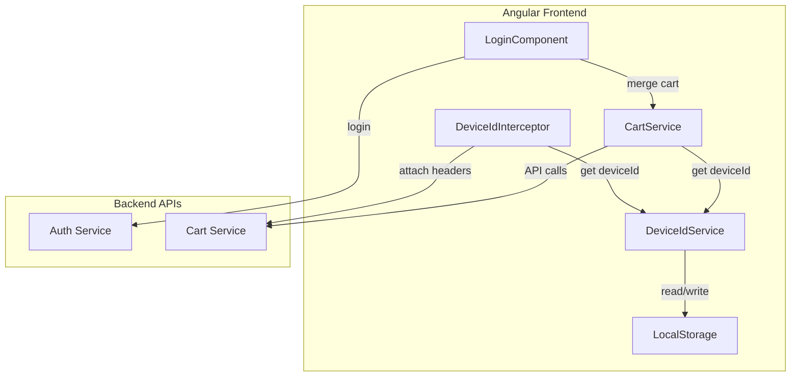

# Design Document: Guest Cart Merge

## Overview

Tính năng Guest Cart Merge cho phép hệ thống frontend Angular ghi nhớ giỏ hàng của khách vãng lai thông qua Device ID và tự động hợp nhất với giỏ hàng user khi đăng nhập. Thiết kế này tập trung vào phía client-side với các thành phần chính:

1. **DeviceIdService** - Quản lý sinh và lưu trữ UUID v4
2. **DeviceIdInterceptor** - HTTP Interceptor đính kèm header X-Device-Id
3. **CartService Enhancement** - Mở rộng service hiện tại để hỗ trợ merge
4. **Login Flow Integration** - Tích hợp merge vào quy trình đăng nhập

## Architecture



## Components and Interfaces

### 1. DeviceIdService

```typescript
// src/app/services/device-id.service.ts

export interface DeviceIdService {
  /**
   * Lấy Device ID hiện tại, sinh mới nếu chưa có
   */
  getDeviceId(): string;
  
  /**
   * Kiểm tra Device ID có tồn tại không
   */
  hasDeviceId(): boolean;
  
  /**
   * Sinh UUID v4 mới (internal use)
   */
  generateUUID(): string;
}

// Constants
export const DEVICE_ID_KEY = 'x-device-id';
export const UUID_V4_PATTERN = /^[0-9a-f]{8}-[0-9a-f]{4}-4[0-9a-f]{3}-[89ab][0-9a-f]{3}-[0-9a-f]{12}$/i;
```

### 2. DeviceIdInterceptor

```typescript
// src/app/interceptors/device-id.interceptor.ts

export interface InterceptorConfig {
  cartApiPatterns: RegExp[];  // URL patterns for cart APIs
}

// Default config
export const DEFAULT_INTERCEPTOR_CONFIG: InterceptorConfig = {
  cartApiPatterns: [
    /\/api\/v1\/cart/,
    /\/cart\//
  ]
};
```

### 3. CartService Enhancement

```typescript
// src/app/services/cart.service.ts (enhanced)

export interface MergeCartRequest {
  deviceId: string;
}

export interface MergeCartResponse {
  success: boolean;
  adjustedItems?: AdjustedItem[];
  message?: string;
}

export interface AdjustedItem {
  sku: string;
  name: string;
  requestedQuantity: number;
  adjustedQuantity: number;
  reason: string;
}

export interface CartService {
  /**
   * Hợp nhất giỏ hàng guest vào user cart
   */
  mergeGuestCart(): Observable<MergeCartResponse>;
  
  /**
   * Lấy giỏ hàng hiện tại (guest hoặc user)
   */
  getCart(): Observable<CartItem[]>;
  
  /**
   * Thêm sản phẩm vào giỏ
   */
  addToCart(item: AddToCartRequest): Observable<void>;
  
  /**
   * Xóa local cart state (khi logout)
   */
  clearLocalCart(): void;
}
```

### 4. Login Flow Integration

```typescript
// Login flow sequence
interface LoginFlow {
  // 1. Submit credentials
  // 2. Receive JWT token
  // 3. Store token
  // 4. Call mergeGuestCart()
  // 5. Handle merge response (show notification if needed)
  // 6. Refresh cart state
  // 7. Redirect to home/previous page
}
```

## Data Models

### LocalStorage Schema

```typescript
// Key: 'x-device-id'
// Value: UUID v4 string
// Example: "550e8400-e29b-41d4-a716-446655440000"
```

### HTTP Headers

```typescript
// For guest users
{
  'X-Device-Id': 'uuid-v4-string'
}

// For authenticated users
{
  'Authorization': 'Bearer jwt-token',
  'X-Device-Id': 'uuid-v4-string'
}
```

### API Contracts

```typescript
// POST /api/v1/cart/merge
// Request
{
  "deviceId": "550e8400-e29b-41d4-a716-446655440000"
}

// Response (success)
{
  "success": true,
  "adjustedItems": []
}

// Response (with adjustments)
{
  "success": true,
  "adjustedItems": [
    {
      "sku": "PROD-001",
      "name": "Mỳ kim chi hải sản",
      "requestedQuantity": 10,
      "adjustedQuantity": 5,
      "reason": "Số lượng tồn kho không đủ"
    }
  ],
  "message": "Một số sản phẩm đã được điều chỉnh số lượng"
}
```

## Correctness Properties

*A property is a characteristic or behavior that should hold true across all valid executions of a system-essentially, a formal statement about what the system should do. Properties serve as the bridge between human-readable specifications and machine-verifiable correctness guarantees.*

### Property 1: Device ID Round Trip Consistency

*For any* Device ID that is generated and stored in LocalStorage, retrieving it should return the exact same value.

**Validates: Requirements 1.1, 1.2**

### Property 2: UUID v4 Format Validity

*For any* Device ID generated by the DeviceIdService, it must match the UUID v4 pattern (xxxxxxxx-xxxx-4xxx-yxxx-xxxxxxxxxxxx).

**Validates: Requirements 1.3**

### Property 3: Cart API Header Attachment

*For any* HTTP request to a cart-related endpoint, the DeviceIdInterceptor must attach the `X-Device-Id` header with the current Device ID value.

**Validates: Requirements 2.1, 2.4, 5.2**

### Property 4: Authenticated Request Headers

*For any* HTTP request made by an authenticated user, both `Authorization` and `X-Device-Id` headers must be present.

**Validates: Requirements 2.2**

### Property 5: Merge API Call Format

*For any* cart merge operation, the request must be a POST to `/api/v1/cart/merge` with the Device ID in the request body.

**Validates: Requirements 3.2**

### Property 6: Post-Merge Cart Refresh

*For any* successful cart merge (200 OK response), the system must subsequently call GET `/api/v1/cart` to refresh the cart state.

**Validates: Requirements 3.3**

### Property 7: Device ID Persistence After Merge

*For any* completed merge operation, the Device ID in LocalStorage must remain unchanged (not deleted).

**Validates: Requirements 3.5**

### Property 8: Logout Cart State Isolation

*For any* logout operation, the local cart state must be cleared while the Device ID in LocalStorage must be preserved.

**Validates: Requirements 5.3**

## Error Handling

### DeviceIdService Errors

| Error Scenario | Handling Strategy |
|----------------|-------------------|
| LocalStorage unavailable | Generate in-memory UUID, log warning |
| LocalStorage quota exceeded | Use existing ID if available, else in-memory |
| Invalid stored UUID format | Generate new UUID, overwrite invalid value |

### Interceptor Errors

| Error Scenario | Handling Strategy |
|----------------|-------------------|
| DeviceIdService throws | Proceed without X-Device-Id header, log error |
| Non-cart API without Device ID | Proceed normally (no header needed) |

### Merge API Errors

| Error Scenario | Handling Strategy |
|----------------|-------------------|
| Network error | Log error, continue login flow, show toast |
| 401 Unauthorized | Token invalid, redirect to login |
| 500 Server error | Log error, continue login flow, show toast |
| Timeout | Log error, continue login flow |

## Testing Strategy

### Unit Testing

Unit tests sẽ được viết cho các component riêng lẻ:

1. **DeviceIdService**
   - Test UUID generation format
   - Test LocalStorage read/write
   - Test idempotent retrieval

2. **DeviceIdInterceptor**
   - Test header attachment for cart URLs
   - Test header skipping for non-cart URLs
   - Test with/without authentication

3. **CartService**
   - Test merge API call
   - Test cart refresh after merge
   - Test error handling

### Property-Based Testing

Sử dụng **fast-check** library cho TypeScript/JavaScript để implement property-based tests.

**Configuration:**
- Minimum 100 iterations per property test
- Shrinking enabled for counterexample minimization

**Test File Naming Convention:**
- `*.property.spec.ts` for property-based tests
- Each test annotated with: `**Feature: guest-cart-merge, Property {number}: {property_text}**`

### Integration Testing

1. **Login Flow Integration**
   - Test complete login -> merge -> redirect flow
   - Test merge failure doesn't block login

2. **Cross-Component Integration**
   - Test DeviceIdService + Interceptor integration
   - Test CartService + DeviceIdService integration
